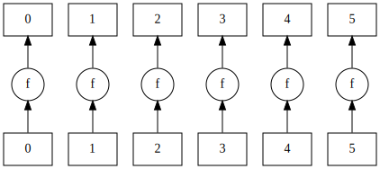
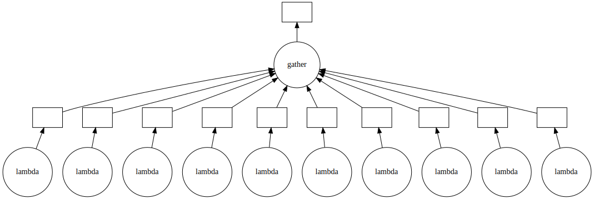

[Dask](https://dask.org/) is one of the many tools available for parallelizing Python code in a comfortable way.
We've seen a basic example of `dask.array` in a previous episode.
Now, we will focus on the `bag` and `delayed` sub-modules.
Dask has a lot of other useful components, such as `dataframe` and `futures`, but we are not going to cover them in this lesson.

See an overview below:

| Dask module      | Abstraction          | Keywords                            | Covered |
|:-----------------|:---------------------|:------------------------------------|:--------|
| `dask.array`     | `numpy`              | Numerical analysis                  | ✔️       |
| `dask.bag`       | `itertools`          | Map-reduce, workflows               | ✔️       |
| `dask.delayed`   | functions            | Anything that doesn't fit the above | ✔️       |
| `dask.dataframe` | `pandas`             | Generic data analysis               | ❌      |
| `dask.futures`   | `concurrent.futures` | Control execution, low-level        | ❌      |

# Parallelize using Dask bags
Dask bags let you compose functionality using several primitive patterns: the most important of these are `map`, `filter`, `groupby` and `reduce`.

> ## Discussion
> Open the [Dask documentation on bags](https://docs.dask.org/en/latest/bag-api.html).
> Discuss the `map` and `filter` and `reduction` methods
{: .discussion}

Operations on this level can be distinguished in several categories:

- **map** (N to N) applies a function *one-to-one* on a list of arguments. This operation is **embarrassingly
  parallel**.
- **filter** (N to &lt;N) selects a subset from the data.
- **groupby** (N to &lt;N) groups data in subcategories.
- **reduce** (N to 1) computes an aggregate from a sequence of data; if the operation permits it
  (summing, maximizing, etc) this can be done in parallel by reducing chunks of data and then
  further processing the results of those chunks.

Let's see an example of it in action:

First, let's create the `bag` containing the elements we want to work with (in this case, the numbers from 0 to 5).

~~~python
import dask.bag as db

bag = db.from_sequence(range(6))
~~~
{: .source}

### Map

To illustrate the concept of `map`, we'll need a mapping function. 
In the example below we'll just use a function that squares its argument:

~~~python
# Create a function for mapping
def f(x):
    return x**2

# Create the map and compute it
bag.map(f).compute()
~~~
{: .source}
~~~
out: [0, 1, 4, 9, 16, 25]
~~~
{:.output}

We can also visualize the mapping:

~~~python
# Visualize the map
bag.map(f).visualize()
~~~
{: .source}

{: .output}

### Filter

To illustrate the concept of `filter`, it is useful to have a function that returns a boolean.
In this case, we'll use a function that returns `True` if the argument is an even integer, and `False` if it is odd:

~~~python
# Return True if x is even, False if not
def pred(x):
    return x % 2 == 0

bag.filter(pred).compute()
~~~
{: .source}
~~~
[out]: [0, 2, 4]
~~~
{: .output}

> ## Difference between `filter` and `map`
> Without executing it, try to forecast what would be the output of `bag.map(pred).compute()`.
> > ## Solution
> > The output will be `[True, False, True, False, True, False]`.
> {: .solution}
{: .challenge}

### Reduction

~~~python
bag.reduction(sum, sum).visualize()
~~~
{: .source}

{: .output}

> ## Challenge
> Look at the `mean`, `pluck`, `distinct`, and `topk` methods. Match them up with `map`, `filter`, `groupby` and `reduce` methods.
> > ## Solution
> > `mean` is a reduction, `pluck` is a mapping, and `topk` is a filter. `distinct` could be implemented by getting the length (`count`, which is a reduction) after a `groupby`.
> {: .solution}
{: .challenge}

> ## Challenge
> Rewrite the following program in terms of a Dask bag. Make it
> spicy by using your favourite literature classic from project Gutenberg as input.
> Example: Adventures of Sherlock Holmes, [(https://www.gutenberg.org/files/1661/1661-0.txt)](https://www.gutenberg.org/files/1661/1661-0.txt)
>
> ~~~python
> from nltk.stem.snowball import PorterStemmer
> stemmer = PorterStemmer()
>
> def good_word(w):
>     return len(w) > 0 and not any(i.isdigit() for i in w)
>
> def clean_word(w):
>     return w.strip("*!?.:;'\",“’‘”()_").lower()
> ~~~
> {: .source}
>
> ~~~python
> text = "Lorem ipsum"
> words = set()
> for w in text.split():
>     cw = clean_word(w)
>     if good_word(cw):
>         words.add(stemmer.stem(cw))
> print("This corpus contains {n} unique words.".format(n=len(words)))
> ~~~
> {: .source}
>
> Tip: start by just counting all the words in the corpus, then expand from there.
> Tip: a "better"/different version of this program would be
>
> ~~~python
> words = set(map(stemmer.stem,
>                 filter(good_word,
>                        map(clean_word, text.split()))))
> len(words)
> ~~~
> {: .source}
>
> > ## Solution
> > Use `read_text` to read the text efficiently, split the words and `flatten` to create a
> > single bag, then `map` to capitalize all the words (or find their stems).
> > To split the words, use `group_by` and finaly `count` to reduce to the number of
> > words. Other option `distinct`.
> >
> > ~~~python
> > bag = db.read_text("./1661-0.txt", blocksize="32k")
> > raw_words = bag.str.split().flatten()
> > clean_words = raw_words.map(clean_word).filter(good_word)
> > stems = clean_words.map(stemmer.stem)
> > unique_words = stems.distinct().count()
> > unique_words.compute(scheduler="processes", num_workers=4)
> > ~~~
> > {: .source}
> {: .solution}
{: .challenge}

> ## Challenge: Dask version of Pi estimation
> > ## Solution
> > ~~~python
> > import dask.bag
> > bag = dask.bag.from_sequence(repeat(10**7, 24))
> > shots = bag.map(calc_pi)
> > estimate = shots.mean()
> > estimate.compute()
> > ~~~
> > {: .source}
> {: .solution}
{: .challenge}

> ## Note
> By default Dask runs a bag using multi-processing. This alleviates problems with the GIL, but also means a larger overhead.
{: .callout}

# Dask Delayed
A lot of the functionality in Dask is based on top of a framework of *delayed evaluation*. The concept of delayed evaluation is very important in understanding how Dask functions, which is why we will go a bit deeper into `dask.delayed`.

~~~python
from dask import delayed
~~~
{: .source}

The `delayed` decorator builds a dependency graph from function calls.

~~~python
@delayed
def add(a, b):
    result = a + b
    print(f"{a} + {b} = {result}")
    return a + b
~~~
{: .source}

A `delayed` function stores the requested function call inside a **promise**. Nothing is being done
yet.

~~~python
x_p = add(1, 2)
~~~
{: .source}

We can check that `x_p` is now a `Delayed` value.

~~~python
type(x_p)
~~~
{: .source}
~~~
[out]: dask.delayed.Delayed
~~~
{: .output}

> ## Note
> It is often a good idea to suffix variables that you know are promises with `_p`. That way you
> keep track of promises versus immediate values.
{: .callout}

Only when we evaluate the computation, do we get an output.

~~~python
x_p.compute()
~~~
{:.source}
~~~
1 + 2 = 3
[out]: 3
~~~
{:.output}

From `Delayed` values we can create larger workflows.

~~~python
x_p = add(1, 2)
y_p = add(x_p, 3)
z_p = add(x_p, y_p)
z_p.visualize(rankdir="LR")
~~~
{: .source}

{: .output}

> ## Challenge: run the workflow
> Run the workflow. How many times is `x_p` computed? We needed it twice.
> > ## Solution
> > ~~~python
> > z_p.compute()
> > ~~~
> > {: .source}
> > ~~~
> > 1 + 2 = 3
> > 3 + 3 = 6
> > 3 + 6 = 9
> > [out]: 9
> > ~~~
> > {: .output}
> > The computation of `x_p` (1 + 2) appears only once.
> {: .solution}
{: .challenge}

We can also make a promise by directly calling `delayed`

~~~python
N = 10**7
x_p = delayed(calc_pi)(N)
~~~
{: .source}

It is now possible to call `visualize` or `compute` methods on `x_p`.

We can build new primitives from the ground up.

~~~python
@delayed
def gather(*args):
    return list(args)
~~~
{: .source}

> ## Challenge: understand `gather`
> Can you describe what the `gather` function does in terms of lists and promises? How would you classify `gather` in terms of parallel programming patterns?
> > ## Solution
> > It turns a list of promises into a promise of a list. This computes from many values to a single object and should be considered a *reduction*.
> {: .solution}
{: .challenge}

We can visualize what `gather` does by this small example.

~~~python
x_p = gather(*(add(n, n) for n in range(10)))
x_p.visualize()
~~~
{: .source}

{: .output}

Computing the result,

~~~python
x_p.compute()
~~~
{: .source}
~~~
[out]: [0, 1, 4, 9, 16, 25, 36, 49, 64, 81]
~~~
{: .output}

> ## Challenge: design a `mean` function
> Write a `delayed` function that computes the mean of its arguments. Complete the program to
> compute pi in parallel.
>
> > ## Solution
> > ~~~python
> > @delayed
> > def mean(*args):
> >     return sum(args) / len(args)
> >
> > pi_p = mean(*(delayed(calc_pi)(N) for i in range(10)))
> > pi_p.compute()
> > ~~~
> > {: .source}
> {: .solution}
{: .challenge}

In practice you may not need to use `@delayed` functions too often, but it does offer ultimate
flexibility. You can build complex computational workflows in this manner, sometimes replacing shell
scripting, make files and the likes.


